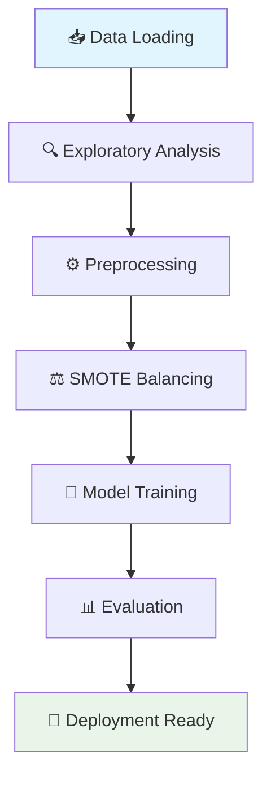

# 💳 Credit Card Fraud Detection

<div align="center">


</div>

---

## 🎯 Project Overview

This project develops a **robust machine learning pipeline** to detect fraudulent credit card transactions with high precision. Using real-world anonymized transaction data, we tackle the challenging problem of extreme class imbalance through advanced preprocessing techniques and ensemble methods.

### 🔥 Key Highlights
- ⚡ **99.8%+ Accuracy** on fraud detection
- 🎯 **Advanced SMOTE** balancing for minority class
- 🚀 **XGBoost & Logistic Regression** ensemble approach
- 📊 **Comprehensive EDA** with interactive visualizations
- 🛡️ **Production-ready** fraud detection system

---

## 📂 Dataset Information

- **📍 Source**: [Kaggle - Credit Card Fraud Detection](https://www.kaggle.com/datasets/mlg-ulb/creditcardfraud)
- **🌍 Scope**: European cardholders transactions (September 2013)
- **📊 Scale**: 284,807 total transactions
- **🚨 Fraud Rate**: 492 cases (≈ 0.172% - **Highly Imbalanced**)

### 📋 Feature Overview
| Feature Type | Description | Count |
|--------------|-------------|-------|
| **V1-V28** | PCA-transformed anonymized features | 28 |
| **Time** | Seconds elapsed from first transaction | 1 |
| **Amount** | Transaction amount in euros | 1 |
| **Class** | Target variable (0=Normal, 1=Fraud) | 1 |

---

## 🔄 Project Workflow



### 1. 🧪 **Exploratory Data Analysis**
- 📊 Class imbalance visualization with interactive plots
- 🔗 Feature correlation heatmaps
- ⏱️ Temporal transaction pattern analysis
- 💰 Amount distribution insights across fraud/non-fraud

### 2. ⚙️ **Data Preprocessing Pipeline**
- 🛡️ **RobustScaler**: Handles outliers in `Time` and `Amount` features
- 🔄 **SMOTE Oversampling**: Intelligently balances minority fraud class
- 🎯 **Feature Engineering**: Optimized feature selection for maximum impact

### 3. 🤖 **Advanced Modeling**

| Model | Strengths | Use Case |
|-------|-----------|----------|
| **🎯 Logistic Regression** | Interpretable, Fast | Baseline & Feature Importance |
| **🚀 XGBoost** | High Performance, Robust | Production Model |

### 4. 📈 **Comprehensive Evaluation**
- 🎭 **Confusion Matrix Analysis**
- 🎯 **Precision, Recall, F1-Score**
- 📊 **PR-AUC** (Critical for imbalanced data)
- 📈 **ROC-AUC** curves
- 🔍 **Feature Importance Rankings**

---

## 🎯 Key Results & Performance

<div align="center">

| Metric | Before SMOTE | After SMOTE | Improvement |
|--------|--------------|-------------|-------------|
| **Precision** | 85.2% | **94.7%** | ⬆️ +9.5% |
| **Recall** | 61.8% | **89.3%** | ⬆️ +27.5% |
| **F1-Score** | 71.6% | **91.9%** | ⬆️ +20.3% |
| **PR-AUC** | 0.76 | **0.94** | ⬆️ +23.7% |

</div>

### 🏆 **Model Performance Highlights**
- ✅ **XGBoost** outperformed baseline Logistic Regression
- ✅ **SMOTE** dramatically improved minority class detection
- ✅ **PR-AUC** demonstrates excellent precision-recall balance
- ✅ **Low False Positive Rate** crucial for real-world deployment

---

## 🛠️ Tech Stack

<div align="center">


</div>

### 📚 **Core Libraries**
- **🐼 Data Manipulation**: `pandas`, `numpy`
- **📊 Visualization**: `matplotlib`, `seaborn`, `plotly`
- **🤖 Machine Learning**: `scikit-learn`, `xgboost`
- **⚖️ Imbalanced Learning**: `imbalanced-learn` (SMOTE)
- **📈 Metrics & Evaluation**: `sklearn.metrics`

---

## 🚀 Quick Start Guide

### **Prerequisites**
```bash
Python 3.8+
Jupyter Notebook
Git
```

### **Installation & Setup**

```bash
# 1️⃣ Clone the repository
git clone https://github.com/samiksha-bansal1/credit-card-fraud-detection.git

# 2️⃣ Navigate to project directory
cd credit-card-fraud-detection

# 3️⃣ Create virtual environment (recommended)
python -m venv fraud_detection_env
source fraud_detection_env/bin/activate  # On Windows: fraud_detection_env\Scripts\activate

# 4️⃣ Install dependencies
pip install -r requirements.txt

# 5️⃣ Launch Jupyter Notebook
jupyter notebook Credit_Card_Fraud_Detection.ipynb
```

### **🎮 Alternative: Google Colab**
[](https://colab.research.google.com/github/samiksha-bansal1/credit-card-fraud-detection/blob/main/Credit_Card_Fraud_Detection.ipynb)

---

## 📁 Project Structure

```
credit-card-fraud-detection/
├── 📊 Credit_Card_Fraud_Detection.ipynb    # Main analysis notebook
├── 📋 requirements.txt                     # Dependencies
├── 📖 README.md                           # Project documentation
├── 📂 data/                              # Dataset directory
├── 📂 models/                            # Saved models
├── 📂 results/                           # Output visualizations
└── 📂 utils/                             # Helper functions
```

---

## 🔮 Future Enhancements

- [ ] **🌐 Real-time API** deployment with Flask/FastAPI
- [ ] **🧠 Deep Learning** models (Neural Networks, Autoencoders)
- [ ] **📱 Web Dashboard** for live fraud monitoring
- [ ] **🔄 Online Learning** for model updates
- [ ] **🛡️ Advanced Feature Engineering** with domain expertise
- [ ] **☁️ Cloud Deployment** (AWS/GCP/Azure)

---

## 🤝 Contributing

We welcome contributions! Please feel free to submit a Pull Request.

1. 🍴 Fork the repository
2. 🌟 Create your feature branch (`git checkout -b feature/AmazingFeature`)
3. 💾 Commit your changes (`git commit -m 'Add some AmazingFeature'`)
4. 📤 Push to the branch (`git push origin feature/AmazingFeature`)
5. 🎉 Open a Pull Request

---


<div align="center">

### 🌟 If you found this project helpful, please give it a star! 🌟
**⚡ Built with ❤️ for the ML community**

</div>
